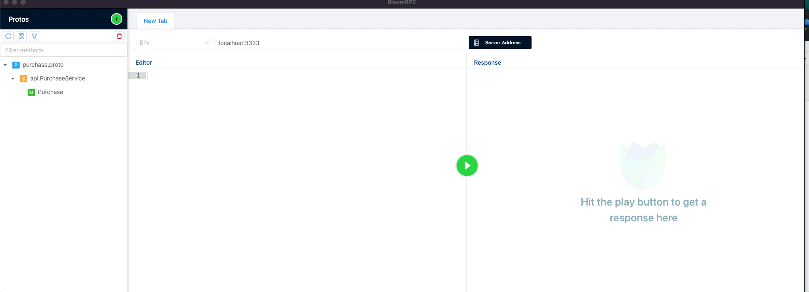

# Purchase Test

# Run project in your local

`docker-compose up -d`

You can check if all is running with:

`docker-compose ps`

Note: This will stop all containers and remove them (if you have some lock file with mysql problem):

`docker stop $(docker ps -a -q)`
`docker rm $(docker ps -a -q)`

BloomRPC:

`localhost:3333`

Load in BloomRPC the file `proto/protobuf/api/purchase.proto`:

# Structure folder project

`.docker`: we have dockerfiles for each binary, in this case only have api dockerfile, the worker folder is an example if we had other binaries.

`.github/workflows`: we have the workflow test.yml with two jobs executing in the pipeline of github (execute in parallel: unit and e2e test)

`cmd`: we have the main files for each binary, in this case only have api, the worker folder is an example if we had other binaries.

`platform`: 
- `k8s`:  here we have folder for kubernetes with helm chart files for integration and production environment. It is empty but is to show the structure of each microservice
- `local`: here only we have the schema.sql loaded in docker-compose to use in local environment and in the pipeline of github.

`proto`: we have proto file to define contracts, they are located in `proto/protobuf` and the folder `proto/go` contains protocol buffers compiled to go language.

`internal`: we have controllers for grpc purchase service and the package purchase. As well we have kit package with helpers to work with uuids and load fixtures in E2E/Integration tests. 

# Makefile

`makefile help`

`makefile test-unit`: execute inside of container test with tag: `unit`.

`makefile test-e2e`: execute inside of container test with tag: `e2e`.

`makefile test-all`: execute inside of container test with tag: `unit` and `e2e`.

`makefile lint`: execut linter with fix to go language.

# Compile protocol buffers

we have the folder proto, this folder can be in other repository and use it like dependency but to simplify we have all in the same
repository.

Read readme file: [README.md](proto/README.md)

Inside of the folder `proto` we have a Makefile so to compile the `purchase.proto` file:

`cd proto`
`make proto`

And this will generate the folder `proto/go/protobuf/api` with file `purchase.pb.go`.

Note: in this case we generate to go language but we can modify the Makefile to compile for `java`, `phyton`, ...
